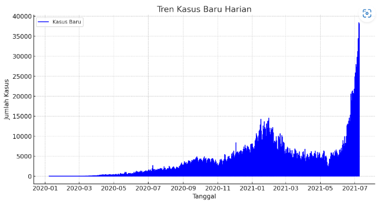
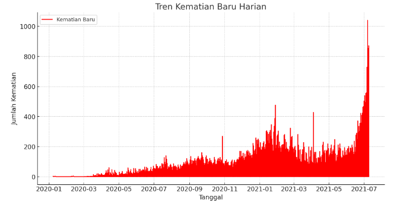

# Capstone Project at Microsoft Indonesia (by Mari Belajar) - Magang dan Studi Independen (MSIB) Kampus Merdeka Batch 1

# Analisis Data COVID-19 Jawa Timur

Repository ini berisi analisis dasar terkait kasus COVID-19 di Jawa Timur menggunakan Python dan Pandas.

## Deskripsi Dataset

Dataset ini berisi informasi harian tentang kasus COVID-19 di Jawa Timur dengan kolom-kolom berikut:

- Date: Tanggal
- Location ISO Code: Kode ISO lokasi
- Location: Nama lokasi
- New Cases: Kasus baru
- New Deaths: Kematian baru
- New Recovered: Kasus sembuh baru
- New Active Cases: Kasus aktif baru
- Total Cases: Total kasus
- Total Deaths: Total kematian
- Total Recovered: Total sembuh
- New Deaths per Million: Kematian baru per juta
- Total Deaths per Million: Total kematian per juta
- Case Fatality Rate: Tingkat fatalitas kasus
- Case Recovered Rate: Tingkat pemulihan kasus
- Growth Factor of New Cases: Faktor pertumbuhan kasus baru
- Growth Factor of New Deaths: Faktor pertumbuhan kematian baru

## Analisis yang Dilakukan

1. **Statistik Deskriptif**: Rangkuman statistik untuk kolom numerik seperti kasus baru, kematian baru, dan sembuh baru.
2. **Visualisasi Tren Kasus Harian**: Grafik visualisasi tren kasus baru harian.
   
4. **Visualisasi Tren Kematian Harian**: Grafik visualisasi tren kematian baru harian.
   
6. **Rasio Fatalitas Kasus dan Tingkat Pemulihan**: Perhitungan rata-rata rasio fatalitas kasus dan tingkat pemulihan.

## Cara Menggunakan

1. Pastikan Python dan Pandas sudah terinstal.
2. Unduh dataset `MariSehat.csv` ke direktori lokal.
3. Jalankan notebook Python untuk melihat analisis lebih lanjut.

## Contoh Penggunaan

```python
import pandas as pd
import matplotlib.pyplot as plt

# Memuat dataset
df = pd.read_csv('MariSehat.csv')

# Contoh visualisasi tren kasus harian
plt.figure(figsize=(10, 6))
plt.plot(df['Date'], df['New Cases'], marker='o', linestyle='-', color='b')
plt.title('Tren Kasus Harian COVID-19 di Jawa Timur')
plt.xlabel('Tanggal')
plt.ylabel('Jumlah Kasus Baru')
plt.xticks(rotation=45)
plt.grid(True)
plt.tight_layout()
plt.show()
